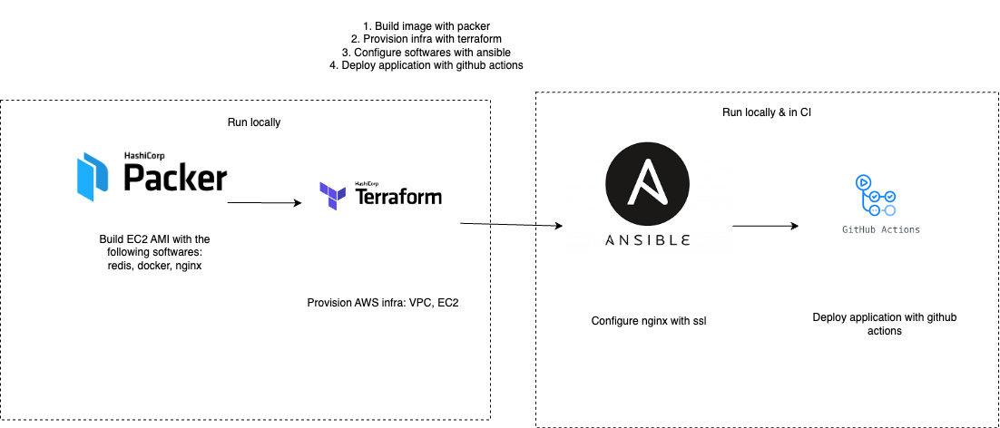

This project is the infrastructure as code management for [Market data notification](https://github.com/hanchiang/market-data-notification) using AWS.

# Structure
- [`images/`](images): Packer files for building the base AMI
  - `image.pkr.hcl`: main Packer template
  - `scripts/`: AMI provisioning scripts
- [`instances/`](instances): Terraform, Ansible, and orchestration for the EC2 runtime
  - `main.tf`: main Terraform entry point
  - `variables.tf`: Terraform variables and AMI lookup
  - `ansible/`: post-provisioning configuration, including nginx and certbot reconciliation
  - `scripts/`: start and stop orchestration, Route53 updates, and backend deploy dispatch

# Prerequisites
- AWS credentials with permission to build the AMI and manage the Terraform-managed resources
- Terraform Cloud access for the `hansolo/market_data_notification` workspace
- Packer
- Terraform
- Ansible for local script-driven reconciliation flows
- `jq`, `curl`, and `aws` CLI for the helper scripts
- SSH access to the target EC2 instance
- GitHub token access when using `instances/scripts/start.sh`, because that script resolves the latest successful backend build and dispatches deployment

# Operator Workflow
## 1. Build the base AMI with Packer
- Work from [`images/`](images).
- Define the variables used by `image.pkr.hcl` in `variables.auto.pkrvars.hcl`.
- The current template provisions Ubuntu 22.04 ARM64 and installs:
  - redis
  - docker
  - nginx
- Build the AMI:

  ```bash
  cd images
  packer build -machine-readable -var-file=variables.auto.pkrvars.hcl image.pkr.hcl | tee build.log
  ```

- Packer variable details and the current legacy Let's Encrypt artifact input are documented in [`images/README.md`](images/README.md).

## 2. Provision or update infra with Terraform
- Work from [`instances/`](instances).
- This repo uses Terraform Cloud, not a local state file.
- The EC2 AMI is selected by the `data.aws_ami.ec2_ami` lookup in `variables.tf`, which resolves the most recent self-owned AMI named `market_data_notification_t4g_small`.
- Do not hand-edit `variables.tf` with a copied AMI ID.
- Use the safe backend/state checklist and rollout guidance in [`instances/README.md`](instances/README.md) before running `terraform plan` or `terraform apply`.

## 3. Run start or stop orchestration
- `instances/scripts/start.sh` is the main operator entry point after infrastructure is in place.
- That script:
  - starts the EC2 instance if needed
  - updates Route53
  - calls `instances/ansible/start.sh`
  - dispatches the backend deploy workflow using the latest successful backend CI SHA on `master`
- `instances/scripts/stop.sh` removes the Route53 record and stops the instance.
- Script-specific behavior is summarized in [`instances/scripts/README.md`](instances/scripts/README.md).

## 4. Understand Ansible's role
- Ansible is not a standalone day-to-day operator entry point in this repo.
- The normal operator path runs Ansible through `instances/scripts/start.sh` and `instances/ansible/start.sh`.
- The current Ansible reconciliation covers:
  - feature-branch Let's Encrypt backup hook setup before TLS reconciliation
  - nginx and certbot TLS setup, with encrypted backup upload triggered on successful certificate issuance or renewal

## 5. Validate live changes carefully
- For the current Let's Encrypt backup work, use the canonical rollout and restore checklist in [`instances/README.md`](instances/README.md).
- The restore checklist includes the operator-side `scp` step for copying the decrypted `.tar.gz` archive onto the target host before extraction and reconciliation.
- Keep the older Packer-time Let's Encrypt artifact path as compatibility state until restore has been exercised successfully.

# Canonical Docs
- Packer usage: [`images/README.md`](images/README.md)
- Terraform backend, state, apply safety, and Let's Encrypt rollout plus restore checklists: [`instances/README.md`](instances/README.md)
- Start and stop scripts: [`instances/scripts/README.md`](instances/scripts/README.md)

# Diagram

